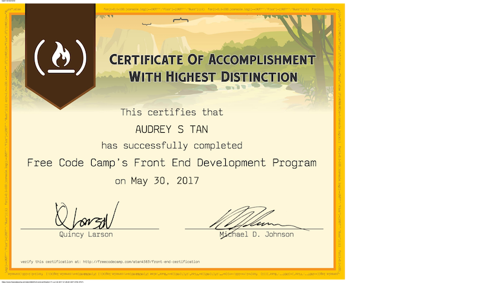

# Web Front End Certification, freeCodeCamp
This repo contains a collection of project deliverables from my Web Front End Certification work.
 ---
#### _The certification work was completed in May 2017, project deliverables are added to this repo for preservation_

## Project Deliverables Summary

### 1. [Build A Simon Game](https://github.com/atan4583/fcc-webfe-portfolio/tree/master/Build%20A%20Simon%20Game)
> * Buid a [CodePen.io](https://codepen.io) app that is functionally similar to this [Simon® Game App](https://codepen.io/FreeCodeCamp/full/obYBjE).
>
>
> * Fulfill the following user stories:
>   - I am presented with a random series of button presses.
>   - Each time I input a series of button presses correctly, I see the same series of button presses but with an additional step.
>   - I hear a sound that corresponds to each button both when the series of button presses plays, and when I personally press a button.
>   - If I press the wrong button, I am notified that I have done so, and that series of button presses starts again to remind me of the pattern so I can try again.
>   - I can see how many steps are in the current series of button presses.
>   - If I want to restart, I can hit a button to do so, and the game will return to a single step.
>   - I can play in strict mode where if I get a button press wrong, it notifies me that I have done so, and the game restarts at a new random series of button presses.
>   - I can win the game by getting a series of 20 steps correct. I am notified of my victory, then the game starts over.
>
>
> * Language: HTML, CSS, JavaScript
>
>
> * Live artifact: [**Simon Game** FCC Advanced FE DEV Project 4](https://codepen.io/atan4583/full/RVzgOW/)
>
>

 ---
### 2. [Build A Tic Tac Toe Game](https://github.com/atan4583/fcc-webfe-portfolio/tree/master/Build%20A%20Tic%20Tac%20Toe%20Game)
> * Buid a [CodePen.io](https://codepen.io) app that is functionally similar to this [Tic Tac Toe Game App](https://codepen.io/FreeCodeCamp/full/KzXQgy).
>
>
> * Fulfill the following user stories:
>   - I can play a game of Tic Tac Toe with the computer.
>   - My game will reset as soon as it's over so I can play again.
>   - I can choose whether I want to play as X or O.
>
>
> * Language: HTML, CSS, JavaScript
>
>
> * Live artifact: [**Tic Tac Toe Game** FCC Advanced FE DEV Project 3](https://codepen.io/atan4583/full/NjZbxo/)
>
>
 ---
### 3. [Build A Pomodoro Clock](https://github.com/atan4583/fcc-webfe-portfolio/tree/master/Build%20A%20Pomodoro%20Clock)
> * Buid a [CodePen.io](https://codepen.io) app that is functionally similar to this [Pomodoro Clock App](https://codepen.io/freeCodeCamp/full/aNyxXR).
>
>
> * Fulfill the following user stories:
>   - I can start a 25 minute pomodoro, and the timer will go off once 25 minutes has elapsed.
>   - I can reset the clock for my next pomodoro.
>   - I can customize the length of each pomodoro.
>
>
> * Language: HTML, CSS, JavaScript
>
>
> * Live artifact: [**Pomodoro Clock** FCC Advanced FE DEV Project 2](https://codepen.io/atan4583/full/QvRopp/)
>
>
 ---
### 4. [Build A JavaScript Calculator](https://github.com/atan4583/fcc-webfe-portfolio/tree/master/Build%20A%20JavaScript%20Calculator)
> * Buid a [CodePen.io](https://codepen.io) app that is functionally similar to this [JavaScript Calculator App](https://codepen.io/FreeCodeCamp/full/rLJZrA).
>
>
> * Fulfill the following user stories:
>   - I can add, substract, multiply and divide two numbers.
>   - I can clear the input field with a clear button.
>   - I can keep chaining mathematical operations together until I hit the equal button, and the calculator will tell me the correct output.
>
>
> * Language: HTML, CSS, JavaScript
>
>
> * Live artifact: [**Javascript Calculator** FCC Advanced FE DEV Project 1](https://codepen.io/atan4583/full/LyoBrK/)
>
>
 ---
### 5. [Use the Twitchtv JSON API](https://github.com/atan4583/fcc-webfe-portfolio/tree/master/Use%20the%20Twitchtv%20JSON%20API)
> * Buid a [CodePen.io](https://codepen.io) app that is functionally similar to this [Twitchtv JSON API App](https://codepen.io/FreeCodeCamp/full/Myvqmo/).
>
>
> * Fulfill the following user stories:
>   - I can see whether Free Code Camp is currently streaming on Twitch.tv.
>   - I can click the status output and be sent directly to the Free Code Camp's Twitch.tv channel.
>   - If a Twitch user is currently streaming, I can see additional details about what they are streaming.
>   - I will see a placeholder notification if a streamer has closed their Twitch account (or the account never existed). You can verify this works by adding brunofin and comster 404 to your array of Twitch streamers.
>
>
> * Language: HTML, CSS, JavaScript
>
>
> * Live artifact: [**Twitchtv JSON API** FCC Intermediate FE DEV Project 4](https://codepen.io/atan4583/full/BRrOvE/)
>
>
 ---
### 6. [Build a Wikipedia Viewer](https://github.com/atan4583/fcc-webfe-portfolio/tree/master/Build%20a%20Wikipedia%20Viewer)
> * Buid a [CodePen.io](https://codepen.io) app that is functionally similar to this [Wikipedia Viewer App](https://codepen.io/FreeCodeCamp/full/wGqEga/).
>
>
> * Fulfill the following user stories:
>   - I can search Wikipedia entries in a search box and see the resulting Wikipedia entries.
>   - I can click a button to see a random Wilipedia entry.
>
>
> * Language: HTML, CSS, JavaScript
>
>
> * Live artifact: [**Wikipedia Viewer** FCC Intermediate FE DEV Project 3](https://codepen.io/atan4583/full/wdmvEX/)
>
>
 ---
### 7. [Show the Local Weather](https://github.com/atan4583/fcc-webfe-portfolio/tree/master/Show%20the%20Local%20Weather)
> * Buid a [CodePen.io](https://codepen.io) app that is functionally similar to this [Local Weather App](http://codepen.io/FreeCodeCamp/full/bELRjV).
>
>
> * Fulfill the following user stories:
>   - I can see the weather in my current location.
>   - I can see a different icon or background on the weather.
>   - I can push a button to toggle between Fahrenheit and Celsius.
>
>
> * Language: HTML, CSS, JavaScript
>
>
> * Live artifact: [**Local Weather App** FCC Intermediate FE DEV Project 2](https://codepen.io/atan4583/full/VbzxVe)
>
>
 ---
### 8. [Build a Personal Portfolio Webpage](https://github.com/atan4583/fcc-webfe-portfolio/tree/master/Build%20a%20Personal%20Portfolio%20Webpage)
> * Buid a [CodePen.io](https://codepen.io) app that is functionally similar to this [Personal Portfolio Webpage App](https://codepen.io/FreeCodeCamp/full/YqLyXB).
>
>
> * Fulfill the following user stories:
>   - I can access all of the portfolio webpage's content just by scrolling.
>   - I can click different buttons that will take me to the portfolio creator's different social media pages.
>   - I can see thumbnail images of different projects the portfolio creator has built (if you haven't built any websites before, use placeholders.)
>   - I navigate to different sections of the webpage by clicking buttons in the navigation.
>
>
> * Language: HTML, CSS, JavaScript
>
>
> * Live artifact: [**Build a Personal Portfolio Webpage** FCC Basic FE DEV Project 2](http://codepen.io/atan4583/full/mWGvmJ/)
>
>
 ---
### 9. [Build a Tribute Page](https://github.com/atan4583/fcc-webfe-portfolio/tree/master/Build%20a%20Tribute%20Page)
> * Buid a [CodePen.io](https://codepen.io) app that is functionally similar to this [Tribute Page App](https://codepen.io/FreeCodeCamp/full/NNvBQW).
>
>
> * Fulfill the following user stories:
>   - I can view a tribute page with an image and text
>   - I can click on a link that will take me to an external website with further information on the topic.
>
>
> * Language: HTML, CSS, JavaScript
>
>
> * Live artifact: **Build a Tribute Page** _FCC Basic FE DEV Project 1_ in [English](https://codepen.io/atan4583/full/GWdydj) and [Deutsch](https://codepen.io/atan4583/full/PpRmBX)
>
>
 ---
